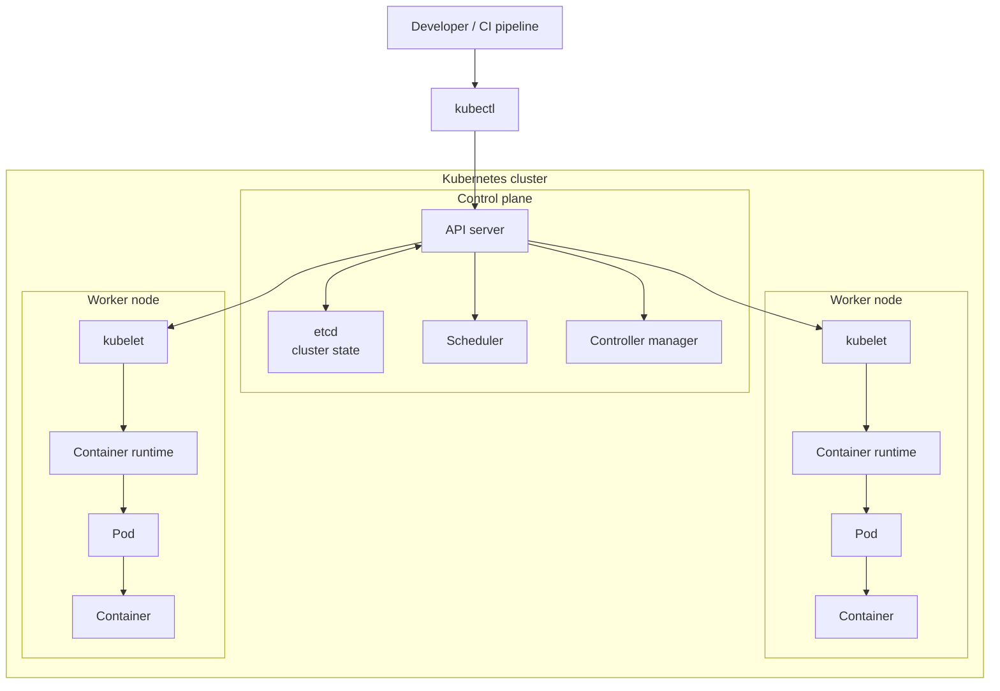

# Docker and Kubernetes: General Overview

## Docker

Docker packages software into **containers**: isolated processes that include an application and the runtime, libraries, and configuration it needs.


### Main Docker components

| Component | Role |
|---|---|
| Docker Client | The `docker` command-line tool. It sends requests such as `build`, `run`, `pull`, and `push`. |
| Docker Daemon | The background service (`dockerd`) that receives requests and creates or manages Docker resources. |
| Dockerfile | A text recipe that defines how to build an image. |
| Image | An immutable template containing an application and its dependencies. |
| Container | A running instance of an image. |
| Registry | A remote repository where images are stored and shared, such as Docker Hub. |
| Volume | Persistent storage managed outside a container's temporary filesystem. |
| Network | A communication layer that lets containers communicate with each other or outside systems. |

### Docker workflow

```text
Source code + Dockerfile
          |
          | docker build
          v
      Docker image
          |
          | docker run
          v
   Running container
```

1. A developer writes source code and a Dockerfile.
2. `docker build` reads the Dockerfile and creates an image in layers.
3. The image may be pushed to a registry with `docker push`.
4. `docker run` creates and starts a container from an image.
5. The container runs until it exits or is stopped.

### Image versus container

An image is like a class or a blueprint: it is reusable and does not change while it is running.

A container is like an object created from that class: it is a live, running instance with its own temporary writable layer.

Several containers can run from the same image at the same time.

## Kubernetes

Kubernetes is a container orchestration platform. It manages how containerized applications are deployed, connected, scaled, updated, and recovered when failures occur.

A single Docker command can run one container. Kubernetes becomes valuable when applications have many containers, need multiple copies, or must remain available despite failures.

## Kubernetes architecture



### How requests become running containers

1. A developer sends a desired-state definition to the API server through `kubectl`.
2. The API server validates the request and records the cluster state in `etcd`.
3. The scheduler selects a worker node for any new Pod.
4. The kubelet on that node receives the assignment.
5. The kubelet asks the container runtime to start the container(s) inside the Pod.
6. Controllers keep checking actual state against desired state and request corrections when necessary.

> Diagram note: Kubernetes separates the **control plane**, which decides and coordinates, from **worker nodes**, which run workloads.

### Cluster architecture

```text
Developer
   |
   | kubectl apply
   v
+--------------------------+
|       Control plane      |
| API server | Scheduler   |
| Controllers | etcd       |
+--------------------------+
              |
              | assigns workloads
              v
+--------------------------+
|        Worker node       |
| kubelet | container      |
|         | runtime        |
|          Pod             |
|       Containers         |
+--------------------------+
```

A Kubernetes cluster has two logical parts:

| Component | Role |
|---|---|
| Control plane | Makes cluster-wide decisions and records the desired state. |
| API server | The front door of Kubernetes. Tools such as `kubectl` send requests to it. |
| etcd | A key-value database that stores cluster configuration and state. |
| Scheduler | Chooses an appropriate worker node for a newly created Pod. |
| Controller manager | Continuously compares desired state with actual state and takes corrective actions. |
| Worker node | A machine, virtual machine, or local node that runs application workloads. |
| Kubelet | An agent on each node that ensures the containers requested for Pods are running. |
| Container runtime | The software that starts and runs containers on a node. |

### Core workload and network objects

| Object | Purpose |
|---|---|
| Pod | The smallest deployable Kubernetes object. It contains one or more tightly related containers that share network and storage. |
| Deployment | Describes an application’s desired state: image version, number of replicas, and update strategy. |
| ReplicaSet | Ensures a specified number of identical Pods exist; normally managed automatically by a Deployment. |
| Service | Provides a stable network endpoint for a changing group of Pods. |
| ConfigMap | Stores non-sensitive configuration separately from the container image. |
| Secret | Stores sensitive configuration such as credentials; it requires careful access control and encryption configuration. |
| Namespace | Logically separates resources within one cluster. |
| Ingress | Defines HTTP or HTTPS routing from outside the cluster to Services. |

### Kubernetes reconciliation loop

Kubernetes works declaratively: instead of manually starting each container, you describe the state you want.

```text
Desired state: "Run 3 copies of version 2"
                    |
                    v
            Kubernetes checks reality
                    |
       +------------+-------------+
       |                          |
Actual state matches         A Pod failed or is missing
       |                          |
       v                          v
   Do nothing              Create a replacement Pod
```

For example, if a Deployment requests three replicas and one Pod crashes, Kubernetes detects that only two healthy replicas remain and creates another Pod. A Deployment also supports rolling updates: it gradually replaces Pods using an old image with Pods using a new image.

## Docker and Kubernetes together

```text
Dockerfile
   |
   v
Docker image
   |
   v
Image registry
   |
   v
Kubernetes pulls image
   |
   v
Pod runs container
   |
   v
Deployment maintains replicas
   |
   v
Service exposes the Pods
```

Docker focuses on **building and running containers**. Kubernetes focuses on **operating containers at scale** across one or more machines.

In practice, Kubernetes uses a container runtime to run containers. Docker images follow widely used container-image standards, so they can generally be used by Kubernetes-compatible runtimes.